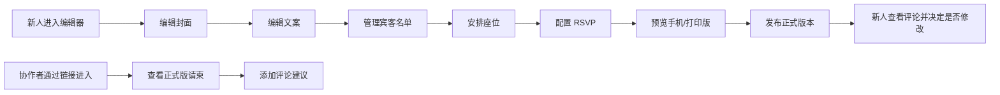

## 1. 产品概述

婚礼请柬在线编辑器——新人可自助编辑封面、文案、宾客名单、座位信息及 RSVP 页面，手机邀请页与打印版共享同一份数据；协作者可留言建议，但无法直接覆盖正式版本。

- **核心目标**：让新人零门槛打造专属婚礼请柬，同时支持协作反馈
- **目标用户**：准新人（主编辑者）、亲友/婚礼策划师（协作者）
- **产品价值**：一站式请柬制作，数据统一驱动多端展示，协作流程清晰可控

## 2. 核心功能

### 2.1 用户角色

| 角色 | 注册方式 | 核心权限 |
|------|----------|----------|
| 新人（编辑者） | 默认进入 | 编辑所有内容、发布正式版本、查看评论、管理协作者 |
| 协作者 | 分享链接进入 | 查看请柬、添加评论建议、查看历史评论 |

### 2.2 功能模块

1. **封面编辑器**：背景图选择、新人姓名、婚礼日期、主标题副标题
2. **文案编辑器**：邀请语、爱情故事、婚礼流程时间线
3. **宾客名单**：添加/编辑/删除宾客、分组管理、导入导出
4. **座位安排**：桌号管理、座位分配、可视化座位图
5. **RSVP 页面**：回复表单定制、出席选项、 dietary 要求
6. **手机预览**：模拟移动端邀请页效果
7. **打印版预览**：适合打印的版式预览
8. **协作评论**：评论区、建议标记、版本区分（正式版 / 草稿建议）

### 2.3 页面详情

| 页面名称 | 模块名称 | 功能描述 |
|----------|----------|----------|
| 编辑器首页 | 左侧导航 + 中间画布 + 右侧属性面板 | 整体编辑工作台布局，Tab 切换不同编辑模块 |
| 封面编辑 | 背景选择、文字编辑、样式调整 | 支持上传背景图或选择预设，编辑新人名字和日期 |
| 文案编辑 | 富文本编辑、时间线组件 | 编辑邀请语、爱情故事、婚礼流程 |
| 宾客管理 | 宾客列表、搜索筛选、批量操作 | 增删改查宾客信息，分组管理 |
| 座位安排 | 桌位可视化、拖拽分配 | 可视化座位图，拖拽宾客到座位 |
| RSVP 配置 | 表单字段配置、选项设置 | 自定义 RSVP 表单字段和选项 |
| 预览页 | 手机预览、打印版预览 | 切换预览模式，实时查看效果 |
| 协作评论 | 评论列表、发表评论 | 协作者可查看和发表评论建议 |

## 3. 核心流程

新人从编辑器首页进入，依次编辑封面、文案、宾客、座位、RSVP，过程中可随时预览手机端和打印版效果。协作者通过分享链接进入预览模式，可查看正式版请柬并添加评论建议，但无法直接修改内容。新人可查看评论并决定是否采纳。

## 4. 用户界面设计

### 4.1 设计风格

- **主色调**：玫瑰金（#C9A96E）+ 象牙白（#FAF7F2），点缀深酒红（#722F37）
- **辅助色**：浅粉（#F5E6E8）、暖灰（#8B7E74）
- **按钮风格**：圆润优雅，微浮雕质感，悬停有轻微光泽动画
- **字体**：标题用 Cormorant Garamond（衬线体，优雅古典），正文用 Lato（无衬线，清晰易读）
- **布局风格**：三栏工作台布局（左导航 + 中画布 + 右属性），卡片式组件
- **装饰元素**：细线分隔、花卉剪影点缀、柔和阴影

### 4.2 页面设计概览

| 页面名称 | 模块名称 | UI 元素 |
|----------|----------|---------|
| 编辑器工作台 | 顶部栏 | Logo、保存状态、预览按钮、角色切换 |
| 编辑器工作台 | 左侧导航 | 图标 + 文字的垂直导航，选中态有金色高亮 |
| 编辑器工作台 | 中间画布 | 手机边框模拟的预览画布，实时渲染编辑内容 |
| 编辑器工作台 | 右侧面板 | 可折叠的属性编辑面板，分组展示可编辑项 |
| 封面编辑 | 背景选择 | 预设背景网格 + 上传按钮 |
| 封面编辑 | 文字样式 | 字体、大小、颜色、对齐方式 |
| 宾客管理 | 列表 | 表格形式，支持搜索和分页 |
| 座位安排 | 座位图 | 圆形桌位，可拖拽分配宾客 |
| 预览页 | 模式切换 | 手机 / 打印版切换按钮 |
| 协作评论 | 评论区 | 时间线式评论列表，头像 + 昵称 + 时间 + 内容 |

### 4.3 响应式

- 桌面端（默认）：三栏布局完整展示
- 平板端：左右面板可收起，中间画布自适应
- 手机端：仅展示核心编辑功能，底部 Tab 导航

### 4.4 动效与交互

- 页面切换：淡入淡出 + 轻微位移
- 按钮悬停：背景色渐变 + 轻微上移
- 画布更新：内容变化时有平滑过渡
- 拖拽操作：半透明幽灵效果 + 落点提示
- 评论出现：从下往上滑入 + 渐显
