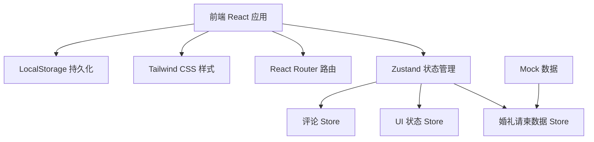
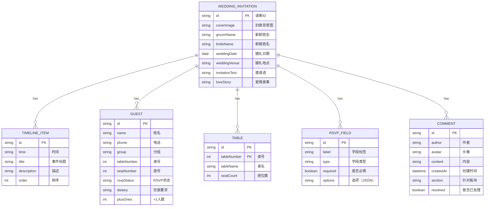

## 1. 架构设计



## 2. 技术描述

- **前端**：React@18 + TypeScript + Vite
- **样式**：TailwindCSS@3
- **状态管理**：Zustand
- **路由**：React Router DOM
- **图标**：Lucide React
- **数据持久化**：LocalStorage（前端模拟）
- **后端**：无（纯前端 Demo，使用 Mock 数据）

## 3. 路由定义

| 路由 | 页面 | 说明 |
|------|------|------|
| `/` | 编辑器首页 | 重定向到封面编辑 |
| `/editor/cover` | 封面编辑 | 编辑封面背景、文字等 |
| `/editor/content` | 文案编辑 | 编辑邀请语、故事、流程 |
| `/editor/guests` | 宾客管理 | 管理宾客名单 |
| `/editor/seating` | 座位安排 | 可视化座位分配 |
| `/editor/rsvp` | RSVP 配置 | 配置回复表单 |
| `/preview/mobile` | 手机预览 | 手机端邀请页预览 |
| `/preview/print` | 打印版预览 | 打印版式预览 |
| `/collaborator` | 协作者视图 | 协作者查看+评论模式 |

## 4. 数据模型

### 4.1 婚礼请柬数据模型



### 4.2 核心类型定义

```typescript
interface WeddingInvitation {
  id: string;
  cover: CoverConfig;
  content: ContentConfig;
  guests: Guest[];
  tables: Table[];
  rsvpFields: RsvpField[];
  publishedVersion: number;
  draftVersion: number;
}

interface CoverConfig {
  backgroundImage: string;
  backgroundColor: string;
  groomName: string;
  brideName: string;
  weddingDate: string;
  weddingVenue: string;
  titleFont: string;
  titleColor: string;
  subtitleColor: string;
}

interface ContentConfig {
  invitationText: string;
  loveStory: string;
  timeline: TimelineItem[];
}

interface TimelineItem {
  id: string;
  time: string;
  title: string;
  description: string;
  order: number;
}

interface Guest {
  id: string;
  name: string;
  phone: string;
  group: string;
  tableNumber: number | null;
  seatNumber: number | null;
  rsvpStatus: 'pending' | 'confirmed' | 'declined';
  dietary: string;
  plusOnes: number;
}

interface Table {
  id: string;
  tableNumber: number;
  tableName: string;
  seatCount: number;
}

interface RsvpField {
  id: string;
  label: string;
  type: 'text' | 'select' | 'checkbox' | 'textarea';
  required: boolean;
  options: string[];
}

interface Comment {
  id: string;
  author: string;
  avatar: string;
  content: string;
  createdAt: string;
  section: string;
  resolved: boolean;
}
```

## 5. 目录结构

```
src/
├── components/          # 通用组件
│   ├── Layout/         # 布局组件
│   ├── Editor/         # 编辑器组件
│   ├── Preview/        # 预览组件
│   ├── Forms/          # 表单组件
│   └── UI/             # 基础UI组件
├── pages/              # 页面组件
│   ├── Editor/         # 编辑器相关页面
│   ├── Preview/        # 预览相关页面
│   └── Collaborator/   # 协作者页面
├── store/              # Zustand stores
│   ├── useInvitationStore.ts
│   ├── useUiStore.ts
│   └── useCommentStore.ts
├── types/              # TypeScript 类型定义
│   └── index.ts
├── data/               # Mock 数据
│   └── mockData.ts
├── utils/              # 工具函数
│   ├── storage.ts
│   └── helpers.ts
├── App.tsx
├── main.tsx
└── index.css
```

## 6. 核心技术方案

### 6.1 数据统一驱动

所有预览（手机端、打印版）共用同一份 Zustand store 数据，编辑时实时更新预览，确保数据一致性。

### 6.2 版本区分机制

- **正式版本**：`publishedVersion`，协作者只能看到此版本
- **草稿版本**：`draftVersion`，新人编辑时的版本
- 发布时将草稿版本同步为正式版本

### 6.3 协作评论

- 评论数据独立存储，关联到具体板块
- 协作者只能添加评论，不能修改请柬数据
- 新人可标记评论为已处理

### 6.4 打印样式

使用 CSS `@media print` 媒体查询，为打印版提供专门样式，确保打印效果美观。
